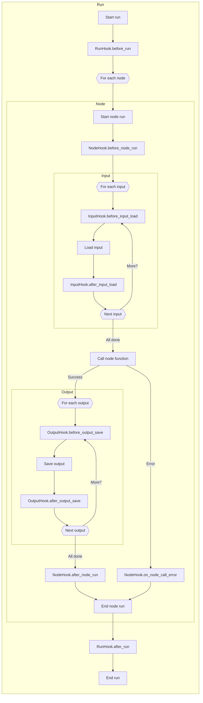

# Hooks

Hooks can be used to run code at certain phases in the run.
With hooks, you can execute custom functionality such as data quality checks, logging and timing, without affecting data transformations in the nodes.

## Why hooks are useful

To see how hooks can be useful, let's consider the following example:

=== "nodes.py"

    ```python
    import catalog
    from ordeq import node


    @node(inputs=catalog.names, outputs=catalog.greetings)
    def greet(names: tuple[str, ...]) -> list[str]:
        """Returns a greeting for each person."""
        greetings = []
        for name in names:
            greetings.append(f"Hello, {name}!")
        return greetings
    ```

=== "catalog.py"

    ```python
    from pathlib import Path

    from ordeq_files import CSV, Text

    names = CSV(path=Path("names.csv"))
    greetings = Text(path=Path("greetings.txt"))
    ```

As we learned [earlier][running-a-node], running the node `greet` is roughly equivalent to:

```pycon
>>> import catalog
>>> names = catalog.names.load()
>>> greetings = greet(names)
>>> catalog.greetings.save(greetings)
```

With hooks, you can inject custom logic around each step.
For example, you might want to log the time taken to load the input `names`:

```pycon hl_lines="2 3 5 6"
>>> import catalog
>>> import time
>>> start_time = time.time()
>>> names = catalog.names.load()
>>> end_time = time.time()
>>> print(f"Loading names took {end_time - start_time} seconds")
>>> greetings = greet(names)
>>> catalog.greetings.save(greetings)
```

As you can see, this custom logic adds a lot of boilerplate code around loading the input.
If you want to do this for every input, it quickly becomes tedious and error-prone.

Instead, you can use a hook to run this logic automatically around every input loading:

```python title="time_hook.py"
import time

from ordeq import Input, InputHook


class TimeHook(InputHook):
    def before_input_load(self, io: Input) -> None:
        self.start_time = time.time()

    def after_input_load(self, io: Input, data) -> None:
        end_time = time.time()
        print(f"Loading {io} took {end_time - self.start_time} seconds")
```

To ensure the hook is executed, it needs to be attached to the input:

=== "catalog.py"

    ```python
    from pathlib import Path

    from ordeq_files import CSV, Text
    from time_hook import TimeHook

    names = CSV(path=Path("names.csv")).with_input_hooks(TimeHook())
    greetings = Text(path=Path("greetings.txt"))
    ```

### Types of hooks

Ordeq provides three types of hooks:

- `RunHook`: called around a set of nodes
- `NodeHook`: called around running a node
- `InputHook`: called around the loading of inputs
- `OutputHook`: called around the saving of outputs

The following diagram depicts how the hooks are applied by Ordeq:



This page demonstrated the concept of hooks and discussed an elementary examples.
For a more elaborate guide, including details on how to implement your own hooks, see [Creating custom hooks][custom-hooks].

!!! success "Where to go from here?"

    - See how to create custom hooks in the [guide][custom-hooks]
    - Check out the [guide on testing nodes][testing-nodes]

[custom-hooks]: ../../guides/examples/benchmark_node_runtime.md
[running-a-node]: nodes.md#running-a-node
[testing-nodes]: ../../guides/testing_nodes.md
