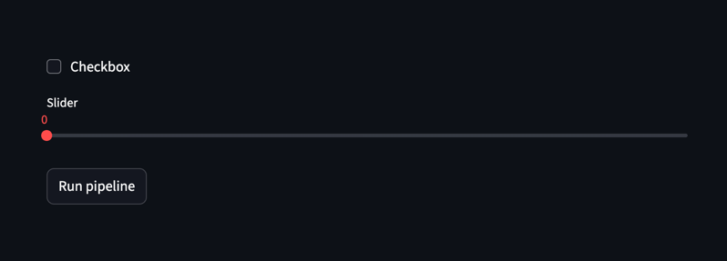

# Streamlit

Streamlit is a lightweight framework for building interactive web apps with Python.
It is ideal for quickly sharing tools, data workflows, and prototypes with users, stakeholders, or collaborators.
As this guide will show, Ordeq can be integrated into Streamlit apps with minimal effort.

!!! tip "Streamlit docs"

    If you are new to Streamlit, consider checking out the [Streamlit documentation][streamlit] for more information.

## Example project

We will cover the example project located [here][integration-streamlit].
This project does the following:

- Creates a Streamlit app with three widgets: a checkbox, a slider, and a button
- When the button is clicked, an Ordeq pipeline is triggered
- The pipeline contains a single node that prints the values of the checkbox and slider

Of course, your project can be more complex, with multiple nodes and data flows.
For instance, you could have a slider that sets a parameter for a machine learning model, or a checkbox that toggles certain features in the pipeline.

Here's the example project structure:

```
integration_streamlit
└── src
    └── example
        ├── __init__.py
        ├── app.py
        ├── catalog.py
        ├── element.py
        └── pipeline.py
```

The `app.py` file contains the Streamlit app code, while `pipeline.py` defines the Ordeq pipeline.
The project [catalog][catalogs] is contained in `catalog.py`.
Lastly, `element.py` defines a [user IO][user-io] that retrieves values from Streamlit widgets.
Click on the tables below to see the contents of each file:

=== "src/example/app.py"

    ```python
    import pipeline
    import streamlit as st
    from ordeq import run

    st.checkbox("Checkbox", key="checkbox")
    st.slider("Slider", 0, 100, key="slider")
    st.button("Run pipeline", on_click=lambda: run(pipeline))
    ```

=== "src/example/element.py"

    ```python
    from dataclasses import dataclass
    from typing import TypeVar

    import streamlit as st
    from ordeq import Input

    T = TypeVar("T")


    @dataclass(frozen=True)
    class StreamlitElement(Input[T]):
        key: str | int


    def load(self) -> T:
        """Loads the value from the Streamlit session state.

        Returns:
            The value associated with the specified key in the session state.

        Raises:
            StreamlitAPIException:
                If the specified key does not exist in the session state.
        """
        return st.session_state[self.key]
    ```

=== "src/example/catalog.py"

    ```python
    from element import StreamlitElement

    slider = StreamlitElement(key="slider")
    checkbox = StreamlitElement(key="checkbox")
    ```

=== "src/example/pipeline.py"

    ```python
    import catalog
    from ordeq import node


    @node(inputs=[catalog.checkbox, catalog.slider])
    def display_values(checkbox: bool, slider: int) -> None:
        # Simply print the values to the console.
        # (Put your own logic here.)
        print(f"Checkbox is {checkbox}")
        print(f"Slider value is {slider}")
    ```

!!! question "Why create an IO for Streamlit elements?"

    You might wonder why we use an IO for Streamlit elements, instead of directly accessing `st.session_state` in the node.
    By using an IO, we isolate the transformation from retrieving values from Streamlit widgets.
    We can test the node logic independently of the Streamlit app, improving modularity and testability.
    You can easily swap out the data source or mock the inputs during testing without modifying the node logic.

## Running the app

To install the dependencies for the example project:

```bash
uv sync
```

!!! tip "New to uv?"

    If you are unfamiliar with uv, check out the [installation guide][uv].

Next, you can launch the example application as follows:

```bash
uv run streamlit run src/example/app.py
```

Open your browser at `http://localhost:8501` to view the app.
This will show the following:



Clicking the button triggers an Ordeq pipeline.
The pipeline prints the configured values of the checkbox and slider to the console, for example:

```text
Checkbox is False
Slider value is 0
```

Try playing around with the checkbox and slider, and click the button to see how the output changes!

!!! question "Questions?"

    If you have any questions or need further assistance, feel free to reach out on [GitHub][issues]

[catalogs]: ../../getting-started/concepts/catalogs.md
[integration-streamlit]: https://github.com/ing-bank/ordeq/tree/main/examples/integration-streamlit
[issues]: https://github.com/ing-bank/ordeq/issues/new
[streamlit]: https://docs.streamlit.io/
[user-io]: ../custom_io.md
[uv]: https://docs.astral.sh/uv/
